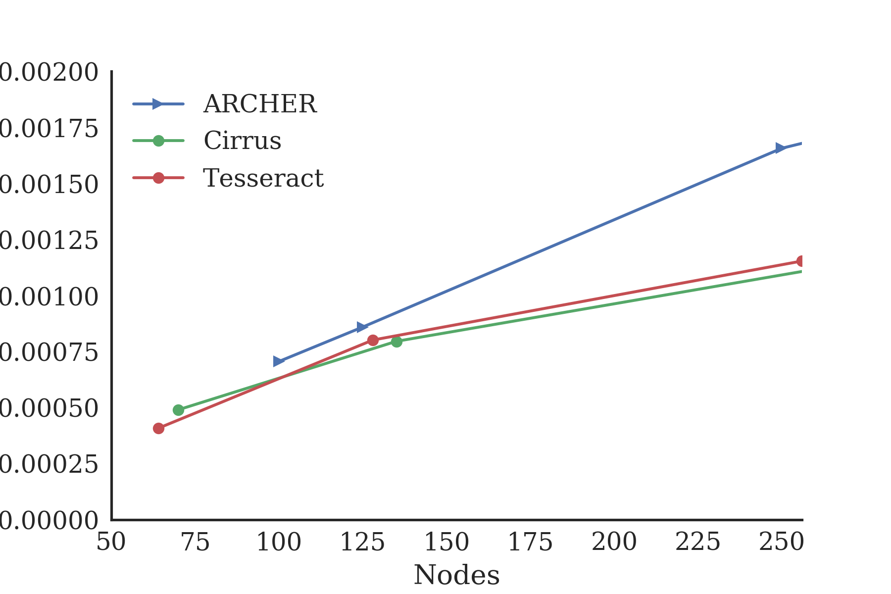
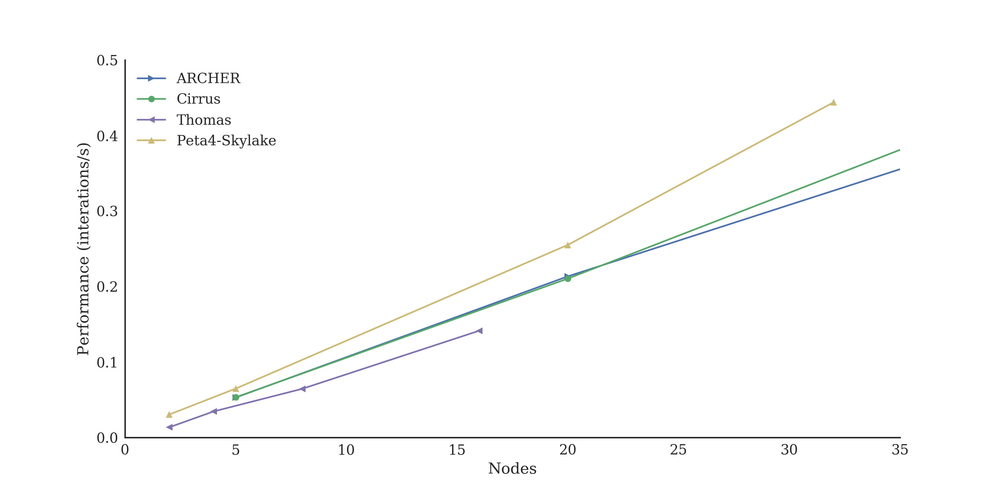
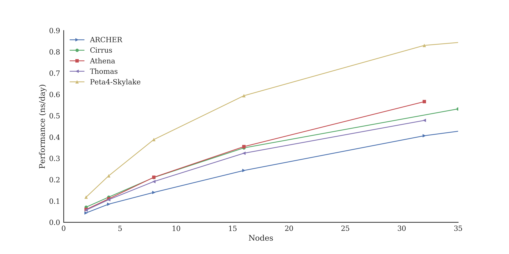
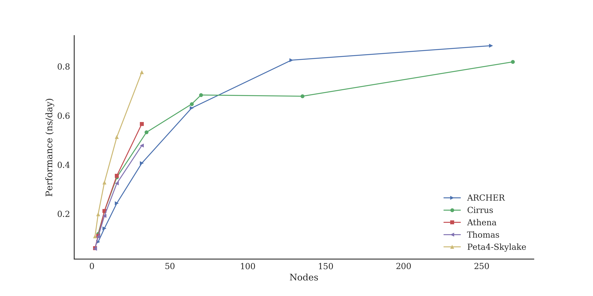
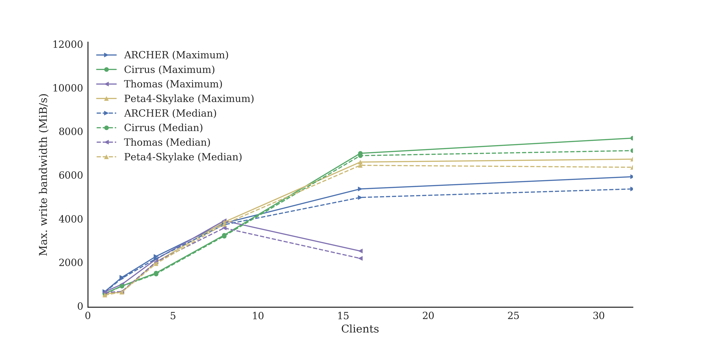
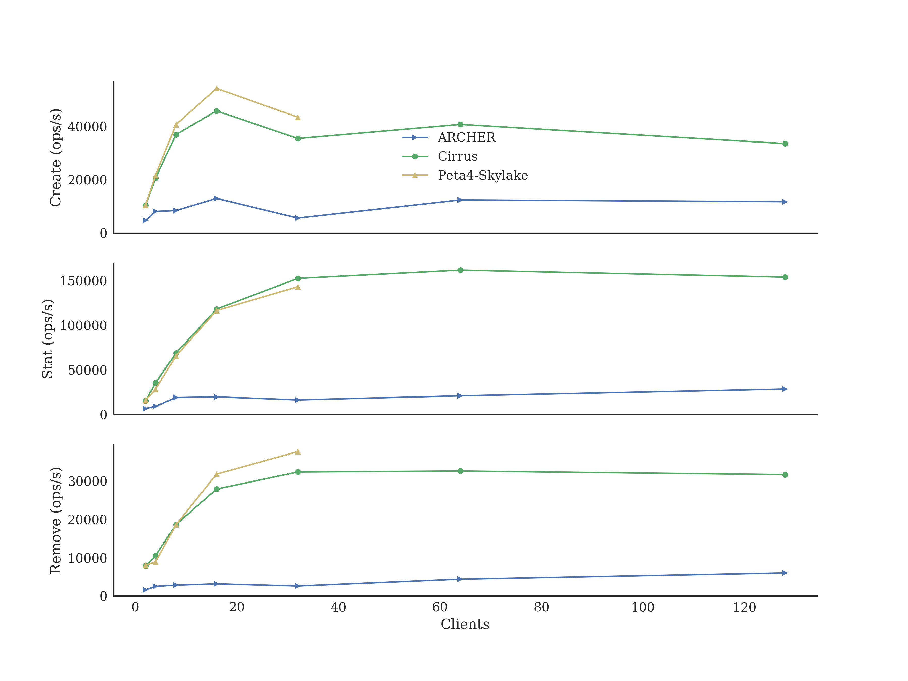

# ARCHER Benchmark Performance

Andy Turner (<mailto:a.turner@epcc.ed.ac.uk>), EPCC, The University of Edinburgh

## Introduction

This paper presents a comparison of the performance of the UK National HPC benchmarks across different HPC systems in the UK. All of the raw data and analysis of the data are available in an Open Source manner from Github at:

<https://github.com/ARCHER-CSE/archer-benchmarks>

This initial version of the performance comparison provides baseline results for the benchmarks and initial analysis and conclusions on the origins of any performance differences. It also provides a large number of avenues for further investigation that will be taken forward and presented in future release of this paper. This paper presents the beginning of an ongoing process of comparison and analysis of the performance of different benchmarks on a variety of HPC systems not an endpoint.

Along with the analysis, a major goal of this initiative is to present an open set of results and analysis that can be contributed to by interested parties and built on and used for further analysis by groups other than ourselves. This philosophy of open contribution and public visibility mirrors that found in the Open Source and Open Data movements and, it is hoped, will allow everyone to extract the most value possible from the benchmarking data.

The remainder of this paper is organised in the following way. Section 3 describes the HPC systems included in this study. Section 4 looks at the differences in performance across different application benchmarks. Parallel I/O benchmark results are presented in Section 5. We conclude with a summary of the results and discussion of future work in this area in Section 6.

This study will be extended as more systems and benchmarks are added.

## HPC Systems

This initial benchmarking exercise covered five Intel Xeon based HPC systems:

-   ARCHER: The UK national supercomputing service, <http://www.archer.ac.uk>

-   Cirrus: Tier2 HPC system provided by EPCC, <http://www.cirrus.ac.uk>

-   Athena: Tier2 HPC system provided by HPC Midlands Plus, <http://www.hpc-midlands-plus.ac.uk/>

-   Thomas: Tier2 HPC system provided by the Materials and Molecular Modelling Hub, <https://mmmhub.ac.uk/>

-   Peta4-Skylake: One component of the CSD3 Tier2 HPC system provided by the University of Cambridge, <http://www.csd3.cam.ac.uk>

The tables below provide further technical details on the systems. Table 1 provides information on the size of the system and the interconnect; Table 2 provides information on the compute node layout, Table 3 provides information on the processor memory hierarchy; and Table 4 provides information on the parallel file systems.

Table 1: System details for the HPC services used in this study

| System        | Nodes (Cores)  | Interconnect | Topology  | EPSRC Tier2 Grant Award |
|---------------|----------------|--------------|-----------|-------------------------|
| ARCHER        | 4,920 (118,080)| Cray Aries   | Dragonfly | N/A                     |
| Cirrus        | 280 (10,080)   | Mellanox FDR | Hypercube | £2.4 million            |
| Athena        |                | Mellanox EDR |           | £3.2 million            |
| Thomas        |                | Intel OPA    |           | £4.0 million            |
| Peta4-Skylake |                | Intel OPA    |           | £5.0 million            |

Table 2: Node details for the HPC services used in this study

| System        | Processors                            | Cores per node  | Memory per node |
|---------------|---------------------------------------|-----------------|-----------------|
| ARCHER        | Intel E5-2697v2 (Ivy Bridge), 2.7 GHz | 24 (2x 12-core) | 64/128 GB       |
| Cirrus        | Intel E5-2695v4 (Broadwell), 2.1 GHz  | 36 (2x 18-core) | 256 GB          |
| Athena        | Intel E5-2680v4 (Broadwell), 2.4 GHz  | 28 (2x 14-core) | 128 GB          |
| Thomas        | Intel E5-2650v4 (Broadwell), 2.1 GHz  | 24 (2x 12-core) | 128 GB          |
| Peta4-Skylake | Intel Gold 6142 (Skylake), 2.6 GHz    | 32 (2x 16-core) | 128 GB          |

Table 3: Processor memory details for the HPC services used in this study

| System        | L1 data cache (per core) | L2 cache (per core) | L3 cache (shared) | Memory channels per socket | Published memory bandwidth per socket (node) |
|---------------|-------------------------:|--------------------:|------------------:|---------------------------:|---------------------------------------------:|
| ARCHER        | 32 KiB                   | 256 KiB             | 30 MiB            | 4                          | 59.7 (119.4) GB/s                            |
| Cirrus        | 32 KiB                   | 256 KiB             | 45 MiB            | 4                          | 76.8 (153.6) GB/s                            |
| Athena        | 32 KiB                   | 256 KiB             | 35 MiB            | 4                          | 76.8 (153.6) GB/s                            |
| Thomas        | 32 KiB                   | 256 KiB             | 30 MiB            | 4                          | 76.8 (153.6) GB/s                            |
| Peta4-Skylake | 32 KiB                   | 1024 KiB            | 22 MiB            | 6                          | 119.2 (238.4) GB/s                           |

Table 4: Parallel file system details for the HPC services used in this study

| System        | Technology         | Vendor                  | Client/Server Version | Configuration |
|---------------|--------------------|-------------------------|-----------------------|---------------|
| ARCHER        | Lustre             | Cray Sonexion           | 2.5/2.1               | 1xMDT, 48xOST |
| Cirrus        | Lustre             | DDN                     | 2.5/2.1               | 1xMDT, 14xOST |
| Athena        | SpectrumScale/GPFS | IBM                     |                       |               |
| Thomas        | Lustre             |                         |                       | 4xMDT, 10xOST |
| Peta4-Skylake | Lustre             | Intel Enterprise Lustre | 2.7/2.7               | 1xMDT, 24xOST |

## Application Benchmarks

In this initial performance comparison, we have run four benchmarks using three different applications:

-   CASTEP: Al Slab (medium) and DNA (large) benchmarks

-   OpenSBLI: Taylor-Green vortex benchmark

-   GROMACS: large simulation benchmark

More details on these benchmarks are found in the individual sections below.

### CASTEP

CASTEP[1] is a general-purpose, DFT-based, materials science application. Written in Fortran with MPI and OpenMP parallelism.

Details of the compile options, job submission scripts, the full output data and analysis scripts are available on GitHub at:

<https://github.com/ARCHER-CSE/archer-benchmarks/tree/master/apps/CASTEP>

We have measured the performance of two CASTEP benchmarks:

-   **Al Slab (al3x3)**: A medium CASTEP benchmark that is able to run on small node counts. This benchmark is able to run on all the systems studied to compare the performance. We expect the performance of this benchmark to depend on the memory-bandwidth and floating-point performance of the processors (especially at low core counts; at higher core counts the performance of MPI collective operations becomes more important). This is a strong scaling benchmark[2].

-   **DNA**: A very large CASTEP benchmark that requires large node counts (a minimum of ~2400 cores). This benchmark was only able to run on the ARCHER and Cirrus systems as the other systems do not support jobs at this scale. We expect this benchmark to be bound by the performance of MPI collective communications. This is a strong scaling benchmark.

#### Al Slab (al3x3)

We compare the performance of the different systems as a function of node count in Figure 8 and present numerical data on single node performance in Table 6. The performance is measured in mean SCF cycles per second (i.e. 1 / mean SCF cycle time). All the raw data for the plot can be found in the repository linked above.

Figure 1: Performance of the medium Al Slab (al3x3) benchmark as a function of number of nodes.

Table 5: Single node performance comparison for CASTEP Al Slab benchmark

| System        | Mean SCF Cycle (s) | Performance relative to ARCHER node |
|---------------|-------------------:|------------------------------------:|
| Peta4-Skylake | 61.280             | 3.006                               |
| Athena        | 100.600            | 1.831                               |
| Cirrus        | 102.421            | 1.798                               |
| Thomas        | 123.312            | 1.494                               |
| ARCHER        | 184.184            | 1.000                               |

To help understand these results, we have used the STREAM benchmark (run within the HPC Challenge synthetic benchmark suite) to measure the memory bandwidth on the different systems. The results from the Triad metric running on all cores on a compute node simultaneously are shown in Table 6. The major difference in measured memory bandwidth per node comes from the generation of processors (and memory) with the newest generation (Peta4-Skylake) having by far the highest memory bandwidth per node (due both the newer technology and additional memory channels available) and the oldest generation (ARCHER) having the lowest memory bandwidth per node). For the systems with the Broadwell generation on processors having more cores per node allows you to access slightly higher measured memory performance per node this actually results in lower measured memory bandwidth **per core** as the additional cores compete for memory bandwidth.

Table 6: Results from HPCC StarSTREAM Triad benchmark

| System        | Cores per node | StarSTREAM per core (GB/s) | StarSTREAM per node (GB/s) |
|---------------|---------------:|---------------------------:|---------------------------:|
| Peta4-Skylake | 32             | 4.508                      | 144.256                    |
| Thomas        | 24             | 3.694                      | 88.656                     |
| Athena        | 28             | 3.304                      | 92.512                     |
| ARCHER        | 24             | 3.036                      | 72.864                     |
| Cirrus        | 36             | 2.718                      | 97.848                     |

Using the memory bandwidth data, we see that the CASTEP Al Slab performance is a function of both node performance (influenced by both the performance per core and the number of cores per node) and memory bandwidth per core; with higher floating-point performance and memory bandwidth leading to higher CASTEP performance. In general, the floating-point performance of the nodes seems to dominate the performance. These conclusions is supported by the following facts:

-   ARCHER (which has the oldest processors in the study) shows the worst performance per node for this benchmark yet has similar memory bandwidth per core to the Tier2 systems with Broadwell generation Xeon processors (Cirrus, Athena, Thomas).

-   Cirrus, Athena, Thomas have same generation of Broadwell processors, but their performance does not strictly follow node floating point performance. It appears that the performance depends on a balance of floating point performance to memory bandwidth per core:

    -   Cirrus has the lowest performance as it has the slowest cores (2.1 GHz) and the lowest measured memory bandwidth per core (even though the nodes are more powerful than both Thomas and Athena in terms of raw floating-point performance). Cirrus loses performance due to lack of memory bandwidth per core to allow it to use the floating point performance available.

    -   Thomas has slightly better performance than Cirrus even though the processors are the same speed. The additional performance is likely to come from the higher memory bandwidth available per core. Thomas loses performance due to lack of floating point performance per node to use the memory bandwidth available.

    -   Athena shows the best performance for this generation of processors as it has the best balance between floating-point performance per node to memory bandwidth per core for these systems. Its node floating point performance is higher than Thomas (but lower than Cirrus) and its memory bandwidth per core is higher than Cirrus (but lower than Thomas).

-   Peta4-Skylake shows the best overall performance for this benchmark as nodes on this system have the highest overall floating-point performance and higher memory bandwidth per core.

#### DNA

We compare the performance of the ARCHER and Cirrus in the plot below (although technically feasible on the other systems, they currently do not allow standard jobs large enough to run this benchmark). The performance is measured in mean SCF cycles per second (i.e. 1 / mean SCF cycle time). All the raw data for the plot can be found in the repository linked above.

Figure 2: Performance of the large DNA benchmark as a function of number of nodes.

The performance of this benchmark depends critically on the performance of MPI collective operations over the interconnect and we can see that ARCHER performs much better than Cirrus at all core counts and this improvement increases as the core count increases. We plan further investigations to understand what causes this difference in performance as there are a range possible reasons (interconnect topology, interconnect performance, MPI library performance, contention for interconnect bandwidth, etc.). We will report the results of these investigations in a future update to this paper.

We are currently liaising with other Tier2 sites to see if this large benchmark can be run outwith their usual queue restrictions to provide further data for comparison.

### OpenSBLI

OpenSBLI[3] is a high-level framework for finite-difference based models, particularly for CFD simulations. It uses a Python-based Domain Specific Language (DSL) which can then generate C++ source code with (optionally) OpenMP, CUDA, OpenCL or OpenACC components for a variety of computer architectures (e.g. CPU, GPGPU).

The OpenSBLI Taylor-Green vortex benchmark was supplied by the UK Turbulence Consortium. We expect this benchmark to be bound primarily by memory bandwidth. This is a strong scaling benchmark.

Details of the compile options, source code for the benchmark, the full output data and analysis scripts are available on GitHub at:

<https://github.com/ARCHER-CSE/archer-benchmarks/tree/master/apps/OpenSBLI>

Figure 3: Performance of the OpenSBLI Taylor-Green vortex benchmark as a function of number of nodes.

As we can see in Figure 10, Peta4-Skylake shows the best performance (but not as large an improvement as for CASTEP), ARCHER and Cirrus performance is very similar at these low node counts, and Thomas shows the lowest performance. We would expect that the additional memory bandwidth available per node (from the addition of 50% more memory channels) on the most recent Intel processors on Peta4-Skylake to give a performance increase for this benchmark and this is what is observed. It is more difficult to understand the lower performance of the Thomas system as it has a similar memory bandwidth per node to both ARCHER and Cirrus, so some other factor is at work here. Further work and profiling is needed to understand these performance data and we plan to report on this in future versions of this paper.

Figure 4 shows the performance of the OpenSBLI benchmark up to high node counts. Results are only currently available for ARCHER and Cirrus as the other systems do not allow standard jobs to scale up to these sizes (although, as mentioned above, there is no technical reason why this scale cannot be run on these systems and we are in discussions to enable this). The trends seen at lower node counts continue as we scale out, with the ARCHER results showing some fluctuations from a linear trend. We plan to investigate the origin of these fluctuations in future versions of this white paper.

Figure 4: Performance of the OpenSBLI Taylor-Green vortex benchmark as a function of number of nodes up to high node counts.

### GROMACS

GROMACS[4] is a classical molecular mechanics-based biomolecular simulation application written in C/C++ with MPI and OpenMP parallelism. It also supports GPGPU (implemented in CUDA) and Xeon Phi (Knights Landing varient) versions.

Details of the compile options, the full output data and analysis scripts are available on GitHub at:

<https://github.com/ARCHER-CSE/archer-benchmarks/tree/master/apps/GROMACS>

We have been provided with a very large benchmark case for GROMACS by the HECBioSim user group. We expect that this benchmark will be largely compute bound but due to its very large size there may be elements that are memory bandwidth bound, especially at lower node counts. As the core counts increase the performance will gradually become MPI point-to-point communications bound. This is a strong scaling benchmark.

We show a comparison of performance for the GROMACS benchmark in Figure 11.

Figure 5: Performance of the large GROMACS benchmark as a function of number of nodes.

These results indicate that the performance of this GROMACS benchmark is directly correlated to node floating point performance. The lowest performance is seen on ARCHER where the older processors have lower floating-point performance and there is the joint lowest core count per node. The best performance is seen on Peta4-Skylake where the newest processors have the highest floating-point performance and there is a high core count per node. Cirrus, Athena and Thomas all have processors with similar floating-point performance; Thomas shows the lowest performance out of these systems as it has the slowest processors combined with fewer cores per node; Athena and Cirrus have higher floating-point performance per node (Athena from additional cores and higher clock speed, Cirrus from additional cores per node) and show better performance.

Figure 6: Performance of the large GROMACS benchmark up to high node counts.

Figure 12 shows the performance up to large node counts (as mentioned above, only ARCHER and Cirrus currently allow jobs to run up to these larger node counts). ARCHER appears to provide slightly better performance at larger node counts in line with the results seen for the large CASTEP DNA benchmark. Further investigations are needed to understand the causes of performance differences at high node counts.

## Parallel I/O Performance

We aimed to measure two aspects of I/O performance that are important for I/O intensive workloads on HPC systems:

-   Parallel write performance. We used the benchio benchmark[5] to measure the performance of using MPI-IO to write to a single shared file from multiple processes. This was a weak scaling test as each MPI process writes a defined amount of data – the total amount of data written increases as the number of MPI processes increases.

-   Metadata server performance: We used the mdtest benchmark from the LANL IOR distribution[6] to measure the performance of the metadata server (MDS). Not all systems could support running this benchmark due to limits on the number files a user that a single user can create (the benchmark needs to be able to create more than 1 million files).

### Parallel write performance: benchio

Details of the compile options, the full output data and analysis scripts are available on GitHub at:

<https://github.com/ARCHER-CSE/archer-benchmarks/tree/master/synth/benchio>

Figure 1 shows the performance of the benchio parallel write benchmark as a function of number of clients (a client is a single compute node, all cores on a node are writing simultaneously). We show both the maximum write performance and the median write performance to give some idea of the performance variation seen. For Lustre file systems, maximum striping (i.e. ‘lfs setstripe -c -1’) was used in all cases. All Lustre file systems have a stripe size of 1 MiB.

Note that we were unable to generate results on the Athena system as the benchmark did not work correctly on the system. We are in contact with the Athena systems team to try and understand what the issue is and hope to have results in a future version of this paper.

The mitigation patches for the recent Meltdown/Spectre security vulnerabilities potentially have an impact on the performance of system calls. These performance impacts are more likely to be seen in I/O performance, so it is important to know the status of implementation of the mitigation patches on the I/O systems on different systems. When these benchmarks were performed, the status was:

-   ARCHER: no patches applied to compute nodes (Lustre clients) or Lustre server nodes

-   Cirrus: no patches applied to compute nodes (Lustre clients) or Lustre server nodes

-   Thomas: patches applied to both compute nodes (Lustre clients) and Lustre server nodes

-   Peta4-Skylake: patches applied to compute nodes (Lustre clients), no patches applied to Lustre server nodes

Figure 7: Write bandwidth measured by benchio benchmark for a single shared file using collective MPI-IO operations as a function of number of clients (a client is a single compute node, all cores on a node are writing simultaneously).

At medium to high numbers of clients (4-32 clients), the performance is broadly similar across most of the systems (with the exception of the Thomas system). The Lustre file system on Thomas reaches its maximum performance at 4 clients and then performance decreases. At low numbers of clients, the performance of the file systems all converge to ~600 MiB/s. At 32 clients the maximum write bandwidth varies from ~6 GiB/s (for ARCHER) up to ~8 GiB/s (for Cirrus). Unsurprisingly, the variation between maximum and median performance grows on all systems as the number of writers increases due to the increased potential for contention with other users on the shared file system and the interconnect (over which parallel I/O traffic passes).

Figure 2 shows a comparison of performance for a wider range of clients (only ARCHER and Cirrus currently support scaling out to larger number of clients in their standard queue configuration). Cirrus seems to reach its maximum bandwidth (~8 GiB/s) at 32 clients with ARCHER requiring 128 clients to reach its maximum bandwidth (~12 GiB/s). In both cases, moving to very high numbers of clients leads to a degradation of performance.

More investigation is needed here to understand the differences in performance. This investigation also includes understanding the technical differences on how the parallel file systems are connected to the clients (compute nodes) in terms of number and performance of fibre connections from the compute node interconnect out to the parallel file system; and the different technical specifications of the Lustre server nodes.

Figure 8: Write bandwidth measured by benchio benchmark for a single shared file using collective MPI-IO operations as a function of number of clients (a client is a single compute node, all cores on a node are writing simultaneously).

### MDS performance: mdtest

Details of the compile options, the full output data and analysis scripts are available on GitHub at:

<https://github.com/ARCHER-CSE/archer-benchmarks/tree/master/synth/mdtest>

Figure 7 shows the performance of one component of the *mdtest* metadata server benchmark as a function of number of clients (a client is a single compute node, all cores on a node are accessing simultaneously). We show the results for multiple processes operating on 1048576 files in a single directory simultaneously. The results for multiple processes operating on files in different directories are available in the online analysis notebook and show similar trends.

Note that we were unable to generate results on the Athena and Thomas systems as they are setup to limit the number of files a single user can create to less than required for the benchmark.

Figure 9: File create, stat and remove performance as a function of number of clients (a client is a single compute node, all cores on a node are accessing simultaneously). This benchmark operates on 1048576 files in a single directory.

The most obvious feature is the poor MDS performance on the ARCHER file systems compared to that on the newer systems, Cirrus and Peta4-Skylake. We are working to try and understand these features.

## Summary and Conclusions

The conclusions from the benchmarking exercise can be split into three broad sections:

-   Performance of application benchmarks at low node counts; where the benchmarks could generally be run on all of the different systems

-   Performance of the application benchmarks at large node counts; where the benchmarks could only be run on the ARCHER and Cirrus systems

-   Performance of the synthetic benchmarks

-   Further work and investigations

### Application benchmark performance at low node counts

Our study reveals that, at low node counts (32 nodes or less), the application benchmarks generally show that the more modern the processor, the better the performance. The latest Skylake processors on the Peta4-Skylake system give the best performance on all application benchmarks to varying degrees. We see that the oldest Ivy Bridge processors on ARCHER give the lowest performance for both the CASTEP Al Slab and GROMACS benchmarks with the results from the Broadwell processors lying in between these two extremes. The OpenSBLI CFD benchmark shows slightly different characteristics, we see that Skylake processors give the best performance (but not by as much as for CASTEP Al Slab and GROMACS benchmarks), ARCHER and Cirrus have similar performance with the Thomas system giving the lowest performance. We plan to perform further profiling work to understand the performance of the OpenSBLI benchmark.

It is also worth noting that the GROMACS benchmark used here was chosen for its scalability and so it is larger than the typical calculations run using GROMACS. This means that its performance characteristics may be different from typical GROMACS calculations at low node counts. In particular, we may expect that this larger benchmark has a higher than normal impact from memory performance. We plan to run a smaller GROMACS benchmark to explore the performance of more typical calculations at lower node counts.

### Application performance at higher node counts

We have only been able to run the benchmarks at higher node counts on the ARCHER and Cirrus services due to job size restrictions in the job submission setup on the other Tier2 systems. These restrictions do not reflect the technical ability of the systems to run parallel jobs at large node counts but, rather, policy decisions to serve the research communities. At higher node counts we see that the performance no longer follows the trend with processor age: in general, ARCHER (which has the oldest processors) shows better performance than Cirrus. At higher node counts, the performance of the application benchmarks seems to be linked more to the performance of the internode communications. This internode communication performance is a combination of interconnect hardware performance, interconnect topology and software. Our results indicate that ARCHER internode communications seem to provide better scale-out performance than on Cirrus and we plan further investigations to understand where this difference comes from..

We are liaising with other Tier2 systems the possibility of running jobs with higher node counts than are usually allowed in order to try and assess the performance of the internode communications (interconnect hardware, interconnect topology and software) on the other systems.

### Parallel I/O benchmark performance

Our results demonstrate that all systems show similar MPI-IO parallel write performance at 16 clients (nodes) and less. Beyond 16 clients, the parallel write performance of the Thomas system deteriorated while the other systems show similar scaling. At larger node counts, the larger ARCHER file system allows it to achieve higher maximum and median performance than the smaller Cirrus file system. This is as expected for Lustre file systems.

Our metadata server (MDS) benchmark results show that the more modern systems (Cirrus and Peta4-Skylake) demonstrate much higher MDS performance that ARCHER. This large difference is currently under investigation in collaboration with the Cray Centre of Excellence. We will report the findings from this investigation in a future version of this paper. We could not measure the MDS performance on Athena and Thomas using this benchmark due to limits on the number of files that a single user is allowed to produce.

### Further work and investigations

Acknowledgements
================

Thanks to all of the HPC systems involved in this study for providing access and resources to be able to run the benchmarks. There explicit acknowledgement statements are included below.

This work used the ARCHER UK National Supercomputing Service (<http://www.archer.ac.uk>).

This work used the Cirrus UK National Tier-2 HPC Service at EPCC (<http://www.cirrus.ac.uk>).

This work used the CSD3 UK National Tier-2 HPC Service at the University of Cambridge (<https://www.csd3.cam.ac.uk/services/csd3-platform>).

This work used the HPC Midlands+ UK National Tier-2 HPC Service (<http://www.hpc-midlands-plus.ac.uk/>).

This work used the Materials and Molecular Modelling Hub UK National Tier-2 HPC Service (<https://mmmhub.ac.uk/>).

