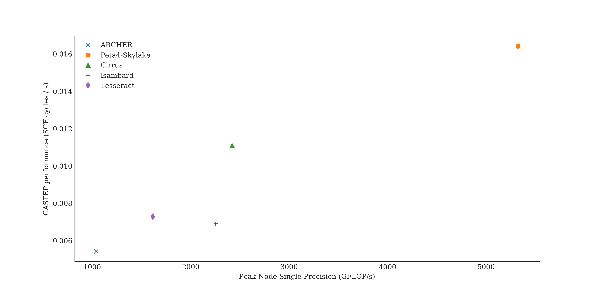
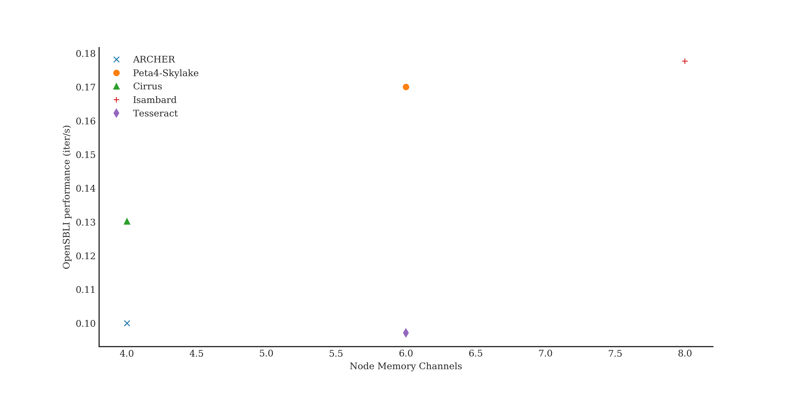
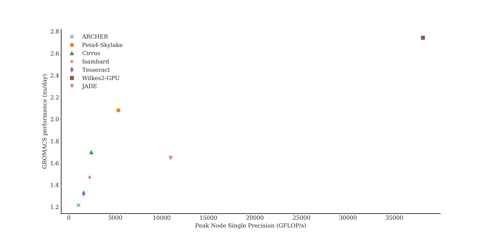
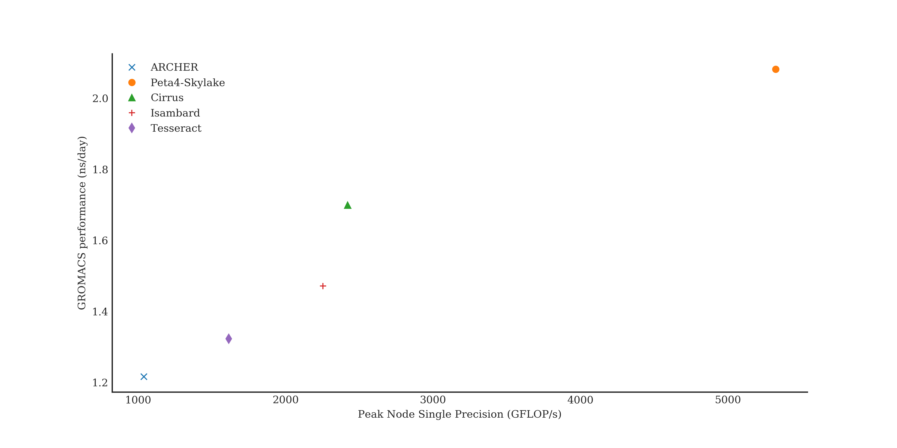

# Performance of HPC Application Benchmarks across UK National HPC services: single node performance

Andy Turner ([a.turner@epcc.ed.ac.uk](mailto:a.turner@epcc.ed.ac.uk)), EPCC, The University of Edinburgh


8 February 2019

## 0. Contents

1. [Introduction](#introduction)
2. [HPC Systems](#systems)
3. [Performance Limits](#raw)
4. [Application Benchmarks](#apps)
5. [Summary and Conclusions](#summary)
6. [Acknowledgements](#acknowledgements)

<a id="introduction"></a>
## 1. Introduction

In a [previous report](https://github.com/hpc-uk/archer-benchmarks/blob/master/reports/initial_comparison/index.md) we
compared the performance of a number of different Intel Xeon-based UK national HPC systems using a range of different benchmarks;
including both application benchmarks and synthetic benchmarks. In this report we broaden the study to compare the 
performance of different processor architectures for the application benchmarks. To reduce the complexity of the comparisons,
we restrict the results in this report to single node only. This allows us to compare the performance of the different
compute node architerctures without the additional complexity of also comparing different interconnect technologies and
topologies. Multi-node comparisons will be the subject of a future report.

As before, the approach taken is to try and evaluate the performance that a standard user would see on the systems.
In particular, this means that large amounts of effort have not been put into optimising the applications used for the application benchmarks in the system. We have used standard central installations of packages where they exist, are accessible to standard users, and have the functionality required for the benchmarks. If central installations do not exist, the applications have been compiled in the standard, recommended way for the systems. All benchmarks have been run on the systems in general production, *i.e.* other user jobs are running as usual when the benchmarks are running. This allows us to experience the same system conditions and potential variability in performance that normal users would see. 

All of the raw data and analysis of the data are available under an Open Source licence from Github at:

-   <https://github.com/hpc-uk/archer-benchmarks>

Along with the analyses, a major goal of this initiative is to present an open set of results and analysis that can be added to by interested parties and built on and used for further analysis by groups other than ourselves. This philosophy of open contribution and public visibility mirrors that found in the Open Source and Open Data movements and, it is hoped, will allow everyone to extract the most value possible from the benchmarking data.

The benchmark applications and benchmark cases were selected with the input of the user community from ARCHER: the UK national supercomputing service. The approach to choosing the benchmarks is described in more detail in an ARCHER white paper:

-   [UK National HPC Benchmarks (PDF)](http://www.archer.ac.uk/documentation/white-papers/benchmarks/UK_National_HPC_Benchmarks.pdf)

The remainder of this paper is organised in the following way. Section 2 describes the HPC systems included in this study; Section 3 presents the performance limits (in terms of floating point and memory performance) for the systems; Section 4 looks at the differences in performance across different application benchmarks. We conclude with a summary of the results and discussion of future work in this area in Section 5.

<a id="systems"></a>
## 2. HPC Systems

This initial benchmarking exercise covered seven UK national HPC systems:

-   ARCHER: The UK national supercomputing service, <http://www.archer.ac.uk>
-   Athena: Tier2 HPC system provided by the HPC Midlands+ consortium, <http://www.hpc-midlands-plus.ac.uk/>
-   Cirrus: Tier2 HPC system provided by EPCC, <http://www.cirrus.ac.uk>
-   Isambard: Tier2 system provided by the GW4 consortium, <http://www.gw4.ac.uk/isambard>
-   JADE: Tier2 system provided by the University of Oxford, <http://www.jade.ac.uk>
-   Peta4-Skylake: One component of the Cumulus Tier2 HPC system provided by the University of Cambridge, <http://www.csd3.cam.ac.uk>
-   Tesseract: The Extreme Scaling component of the DiRAC UK national HPC resource at The University of Edinburgh, <http://www.dirac.ac.uk>
-   Thomas: Tier2 HPC system provided by the Materials and Molecular Modelling Hub, <https://mmmhub.ac.uk/>
-   Wilkes2-GPU: One component of the Cumulus Tier2 HPC system provided by the University of Cambridge, <http://www.csd3.cam.ac.uk>

The tables below provide further technical details on the systems. [Table 1](#tab1) provides information on the size of the system and the interconnect; [Table 2](#tab2) provides information on the compute node layout, [Table 3](#tab3) provides information on the processor memory hierarchy; and [Table 4](#tab4) provides information on the parallel file systems.

<a id="tab1"></a>Table 1: System details for the HPC services used in this study

| System        | CPU                         | Accelerator  | EPSRC Tier2 Grant Award         |
|---------------|-----------------------------|--------------|---------------------------------|
| ARCHER        | Intel Xeon (Ivy Bridge)     | None         | N/A                             |
| Athena        | Intel Xeon (Broadwell)      | None         | £3.2 million                    |
| Cirrus        | Intel Xeon (Broadwell)      | None         | £2.4 million                    |
| Isambard      | Marvell Arm ThunderX2       | None         | £3.0 million                    |
| JADE          | Intel Xeon (Broadwell)      | NVidia P100  | £3.0 million                    |
| Peta4-Skylake | Intel Xeon (Skylake Gold)   | None         | £5.0 million as part of Cumulus |
| Tesseract     | Intel Xeon (Skylake Silver) | None         | N/A                             |
| Thomas        | Intel Xeon (Broadwell)      | None         | £4.0 million                    |
| Wilkes2-GPU   | Intel Xeon (Broadwell)      | NVidia P100  | £5.0 million as part of Cumulus |

<a id="tab2"></a>Table 2: Node CPU details for the HPC services used in this study

| System        | Processors                                 | Cores per node  | Memory per node |
|---------------|--------------------------------------------|-----------------|-----------------|
| ARCHER        | Intel Xeon E5-2697v2 (Ivy Bridge), 2.7 GHz | 24 (2x 12-core) | 64/128 GB       |
| Athena        | Intel E5-2680v4 (Broadwell), 2.4 GHz       | 28 (2x 14-core) | 128 GB          |
| Cirrus        | Intel Xeon E5-2695v4 (Broadwell), 2.1 GHz  | 36 (2x 18-core) | 256 GB          |
| Isambard      | Marvell Arm ThunderX2, 2.2 GHz             | 64 (2x 32-core) | 256 GB          |
| JADE          | Intel Xeon E5-2698v4 (Broadwell), 2.2 GHz  | 40 (2x 20-core) | 96 GB           |
| Peta4-Skylake | Intel Xeon Gold 6142 (Skylake), 2.6 GHz    | 32 (2x 16-core) | 192/384 GB      |
| Tesseract     | Intel Xeon Silver 4112 (Skylake), 2.1 GHz  | 24 (2x 16-core) | 96 GB           |
| Thomas        | Intel E5-2650v4 (Broadwell), 2.1 GHz       | 24 (2x 12-core) | 128 GB          |
| Wilkes2-GPU   | Intel Xeon E5-2660v4 (Broadwell), 2.2 GHz  | 12 (1x 12-core) | 192/384 GB      |

<a id="tab3"></a>Table 3: Processor memory details for the HPC services used in this study

| System        | L1 data cache (per core) | L2 cache (per core) | L3 cache (shared) | Memory channels per socket | Published memory bandwidth per socket (node) |
|---------------|-------------------------:|--------------------:|------------------:|---------------------------:|---------------------------------------------:|
| ARCHER        | 32 KiB                   | 256 KiB             | 30 MiB            | 4                          | 59.7 (119.4) GB/s                            |
| Athena        | 32 KiB                   | 256 KiB             | 45 MiB            | 4                          | 76.8 (153.6) GB/s                            |
| Cirrus        | 32 KiB                   | 256 KiB             | 45 MiB            | 4                          | 76.8 (153.6) GB/s                            |
| Isambard      | 32 KiB                   | 256 KiB             | 32 MiB            | 8                          | 160.0 (320.0) GB/s                           |
| JADE          | 32 KiB                   | 1024 KiB            | 22 MiB            | 6                          | 119.2 (238.4) GB/s                           |
| Peta4-Skylake | 32 KiB                   | 1024 KiB            | 22 MiB            | 6                          | 119.2 (238.4) GB/s                           |
| Tesseract     | 32 KiB                   | 1024 KiB            | 22 MiB            | 6                          | 119.2 (238.4) GB/s                           |
| Thomas        | 32 KiB                   | 256 KiB             | 45 MiB            | 4                          | 76.8 (153.6) GB/s                            |
| Wilkes2-GPU   | 32 KiB                   | 1024 KiB            | 22 MiB            | 6                          | 119.2 (238.4) GB/s                           |

<a id="tab4"></a>Table 4: Node accelerator details for the HPC services used in this study

| System        | Accelerator Model | Accelerator Memory |
|---------------|-------------------|-------------------:|
| Wilkes2-GPU   | P100-PCIE-16GB    | 16 GB              |
| JADE          | P100-SXM2-16GB    | 16 GB              |

<a id="raw"></a>
## 3. Performance Limits

To help understand the benchmark performance we have calculated the theoretical peak floating point performance for 
each of the systems and also measured the memory bandwidth using the STREAM benchmark (run within the [HPC Challenge
synthetic benchmark suite](https://icl.utk.edu/hpcc/)). STREAM is a simple synthetic benchmark program that measures
sustainable memory bandwidth.

[Table 5](#tab5) details the theoretical single precision (SP) floating point performance for each of the systems used in our exercise
and [Table 6](#tab6) shows some of the processor charateristics used to compute the CPU GFLOP/s performance figures. (Double
precision performance is half the single precision value). The 
compute nodes with GPU accelerators have by far the highest theoretical floating point performance. Of the CPU-based systems,
the Peta4-Skylake nodes (Intel Xeon Skylake Gold) have more than twice the theoretical floating point performance of the
next highest performing CPU nodes (Cirrus, Intel Xeon Broadwell). The Isambard (Marvell ThunderX2) copmpute nodes have similar
theoretical performance to the Broadwell system with the Tesseract (Intel Xeon Skylake Silver) compute nodes having lower floating point 
performance and ARCHER (Intel Xeon Ivy Bridge) compute nodes having the lowest theoretical maximum floating point performance.
All of these calculations assume that any processer turbo modes (that can increase the clock speed) are not employed. This 
assumption may not hold in some use configurations but should not have a large effect on the ordering of the performance.

<a id="tab5"></a>Table 5: Theoretical maximum floating point performance for different platforms. CPU FLOPS are computed as
(number of cores used) &times; (single precision FLOPS per cycle) &times; (frequency). See [Table 10](#tab10) for values used for the different
systems. GPU FLOPS are computed as (number of GPUs used) &times; ([GPU single precision FLOPS reference value](https://www.nvidia.com/en-us/data-center/tesla-p100/)). (Assuming base clock frequency without turbo mode.)

| System        | Cores used | CPU SP GFLOP/s | GPU used | GPU SP GFLOP/s | Node SP GFLOP/s | Node SP performace relative to ARCHER node |
|---------------|-----------:|---------------:|---------:|---------------:|----------------:|-------------------------------------------:|
| Wilkes2-GPU   | 12         | 885            | 4        | 37,200         | 38,085          | 36.649                                     |
| JADE          | 5          | 352.0          | 1        | 10,600         | 10,952          | 10.561                                     |
| Peta4-Skylake | 32         | 5,325          | 0        |                | 5,325           | 5.135                                      |
| Cirrus        | 36         | 2,419          | 0        |                | 2,419           | 2.326                                      |
| Isambard      | 64         | 2,253          | 0        |                | 2,253           | 2.172                                      |
| Athena        | 28         | 2,150          | 0        |                | 2,150           | 2.074                                      |
| Tesseract     | 24         | 1,613          | 0        |                | 1,613           | 1.555                                      |
| Thomas        | 24         | 1,613          | 0        |                | 1,613           | 1.555                                      |
| ARCHER        | 24         | 1,037          | 0        |                | 1,037           | 1.000                                      |

<a id="tab6"></a>Table 6: Processor charateristics used to compute CPU FLOPS.

| System        | SP FLOPS per cycle | Clock speed (GHz) | Single core SP GFLOP/s |
|---------------|-------------------:|------------------:|-----------------------:|
| Peta4-Skylake | 64                 | 2.6               | 166.4                  | 
| Athena        | 32                 | 2.4               | 76.8                   | 
| Cirrus        | 32                 | 2.1               | 67.2                   |
| Tesseract     | 32                 | 2.1               | 67.2                   |
| Thomas        | 32                 | 2.1               | 67.2                   |
| Isambard      | 16                 | 2.2               | 35.2                   |
| ARCHER        | 16                 | 2.7               | 43.2                   | 

The results from the STREAM Triad metric running on all cores on a compute node simultaneously (StarSTREAM) are shown in [Table 7](#tab7).
The Triad metric is the most complex kernel within STREAM and is considered the most relevant for HPC. The STREAM Triad kernel
corresponds to:

```
for (i =0; i<N; i++) { 
    a[i] = b[i] + c[i] * SCALAR;
}
```

For the StarSTREAM Triad benchmark, the two Intel Xeon Skylake systems (Tesseract, Skylake Silver, and Peta4-Skylake,
Skylake Gold) show the highest per core memory bandwidth with the Marvell ThunderX2 Arm64 system (Isambard) having the
highest per-node memory bandwidth. 

<a id="tab7"></a>Table 7: Results from HPCC StarSTREAM Triad benchmark. Results from best performing run.

| System        | Cores per node | Memory Channels | StarSTREAM per core (GB/s) | StarSTREAM per node (GB/s) |
|---------------|---------------:|----------------:|---------------------------:|---------------------------:|
| Tesseract     | 24             | 6               | 5.181                      | 124.339                    |
| Peta4-Skylake | 32             | 6               | 4.508                      | 144.256                    |
| Thomas        | 24             | 4               | 3.694                      | 88.656                     |
| Isambard      | 64             | 8               | 3.461                      | 221.485                    |
| Athena        | 28             | 4               | 3.304                      | 92.512                     |
| ARCHER        | 24             | 4               | 3.036                      | 72.864                     |
| Cirrus        | 36             | 4               | 2.718                      | 97.848                     |

<a id="apps"></a>
## 4. Application Benchmarks

In this initial performance comparison, we have run three benchmarks using three different applications:

-   [CASTEP](#castep): Al Slab benchmark (not on GPU systems)
-   [OpenSBLI](#osbli): Taylor-Green vortex 512^3 benchmark (not on GPU systems)
-   [GROMACS](#gromacs): 1400k atom benchmark

More details on these benchmarks are found in the individual sections below.

A rendered Python notebook with the analysis used to produce the perfomance data reported below can be found on GitHub at:

-   <https://github.com/hpc-uk/archer-benchmarks/blob/master/analysis/Single_Node_Performance_Comparison.ipynb>

<a id="castep"></a>
### 4.1 CASTEP

[CASTEP](http://www.castep.org) is a general-purpose, DFT-based, materials science application. Written in Fortran with MPI and OpenMP parallelism.

<a id="tab8"></a>Table 8: Summary of CASTEP compile options on different platforms

| System        | Compiler         | Libraries                                           |
|---------------|------------------|-----------------------------------------------------|
| ARCHER        | GCC 6.1          | Intel MKL 17.0.098, FFTW 3.3.4.11, Cray MPT 7.5.5   |
| Athena        | GCC 6.3          | Intel MKL 17.2.174, Intel MPI 17.2.174              |
| Cirrus        | Intel 17.2.174   | Intel MKL 17.2.174, SGI MPT 2.16                    |
| Isambard      | Cray 8.7.0.5323  | Cray LibSci 17.09.1.2, FFTW 3.3.6.3, MPICH 3.2.0.4  |
| Peta4-Skylake | Intel 17.4       | Intel MKL 17.4, FFTW 3.3.6, Intel MPI 17.4          |
| Tesseract     | GCC 7.3          | Intel MKL 18.1.163, Intel MPI 18.1.163              |
| Thomas        | Intel 18.3       | Intel MKL 18.3, Intel MPI 18.3                      |

Full details of the compile options, job submission scripts, the full output data and analysis scripts are available on GitHub at:

-   <https://github.com/hpc-uk/archer-benchmarks/tree/master/apps/CASTEP>

The CASTEP application does not currently support execution on GPU accelerators (although this functionality is currently
under development by the CASTEP team) so we only include results for CPU-based systems.

We have measured the performance of the **Al Slab (al3x3)** benchmark that is able to run on small node counts. We expect the single-node performance of this benchmark to depend on the floating-point performance of the processors. This is a strong scaling benchmark. This benchmark uses double precision floating point operations (as is used in practice by users).

**Note:** *Strong scaling* is where the number of parallel processes/threads is increased while the problem size is kept the same. This generally leads to each process/thread having less computational work as the number of processes/threads is increased.

We compare the single-node performance in [Table 8](#tab8). The performance is measured in mean SCF cycles per second (i.e. 1 / mean SCF cycle time). All the raw data for the table can be found in the repository linked above.

<a id="tab8"></a>Table 8: Single node performance comparison for CASTEP Al Slab benchmark. Results from best performing run.

| System        | Performance (mean SCF cycles/s) | Performance relative to ARCHER node | Notes        |
|---------------|--------------------------------:|------------------------------------:|--------------|
| Peta4-Skylake | 0.01643                         | 3.026                               | 32 MPI tasks |
| Cirrus        | 0.01086                         | 2.001                               | 36 MPI tasks |
| Athena        | 0.00995                         | 1.832                               | 28 MPI tasks |
| Athena        | 0.00946                         | 1.742                               | 24 MPI tasks |
| Isambard      | 0.00873                         | 1.608                               | 64 MPI tasks |
| Tesseract     | 0.00731                         | 1.346                               | 24 MPI tasks |
| ARCHER        | 0.00543                         | 1.000                               | 24 MPI tasks |

To try and understand what characteristic of the compute nodes on the different systems is leading to the observed
performance differences, we assess the correlation between floating point performance and the CASTEP benchmark
performance. We also compute the correlation between the CASTEP benchmark performance and memory performance,
both in terms of peak bandwdth and in terms of the number of memory channels. To measure the correelation we have used two different tests:

-   Pearson correlation test: this assesses the level of correlation between the values from two datasets. This value varies between -1 (absolute negative correlation) and +1 (absolute postive correlation).
-   Spearman rank-order correlation test: this assesses the level of correlation between the ordering of the values from two datasets. As for Pearson, this value varies between -1 (absolute negative correlation) and +1 (absolute postive correlation).

[Figure 1](#fig1) plots the CASTEP performance against node floating point performance for the different systems studied and [Table 9](#tab9) shows the correlation coeffients for the CASTEP benchmark with different aspects of the compute nodes. CASTEP benchmark performance is very strongly correlated to floating point performance - both quantitatively (Pearson: 0.95) and in order (Spearman: 0.90). This is due to the fact that, on a single node, most of the time for this CASTEP benchmark is spent in LAPACK numerical routines which are well-optimised to exploit the maximum floating point performance from the processors. Conversely, there is effectively no correlation between CASTEP benchmark performance and the memory aspects of the compute nodes. The scatter plot also shows that the system furthest from the correlation line is Isambard (Marvell Arm ThunderX2) impying that this system is not exploiting the floating point performance as well as the other systems.

<a id="fig1"></a>Figure 1: Scatter plot of CASTEP performance vs. floating point performance for the CASTEP Al Slab benchmark


<a id="tab9"></a>Table 9: Correlation coefficients for different aspects of systems hardware correlated to performance of 
the CASTEP Al Slab benchmark

| Aspect                     | Pearson | Spearman |
|----------------------------|--------:|---------:|
| Floating Point Performance |  0.96   |  0.87    |
| Memory Bandwidth           |  0.21   | -0.04    |
| Memory Channels            |  0.14   | -0.06    |

<a id="osbli"></a>
### 4.2 OpenSBLI

[OpenSBLI](https://opensbli.github.io/) is a high-level framework for finite-difference based models, particularly for CFD simulations. It uses a Python-based Domain Specific Language (DSL) which can then generate C++ source code with (optionally) OpenMP, CUDA, OpenCL or OpenACC components for a variety of computer architectures (e.g. CPU, GPGPU). This benchmark uses double precision floating point operations (as is used in practice by users).

The OpenSBLI 512^3, Taylor-Green vortex benchmark was supplied by the UK Turbulence Consortium. We expect this benchmark to be bound primarily by memory performance. This is a strong scaling benchmark.

<a id="tab8"></a>Table 8: Summary of OpenSBLI compile options on different platforms

| System        | Compiler         | Libraries                       |
|---------------|------------------|---------------------------------|
| ARCHER        | Cray 8.5.8       | HDF5 1.10.0.1, Cray MPT 7.5.2   |
| Athena        | Intel 17.2.174   | HDF5 1.10.1, Intel MPI 17.2.174 |
| Cirrus        | Intel 17.2.174   | HDF5 1.10.1, SGI MPT 2.16       |
| Isambard      | Cray 8.7.0.5323  | HDF5 1.10.2, MPICH 3.2.0.4      |
| Peta4-Skylake | Intel 17.4       | HDF5 1.10.1, Intel MPI 17.4     |
| Tesseract     | Intel 18.1.163   | HDF5 1.10.1, Intel MPI 18.1.163 |
| Thomas        | Intel 18.3       | HDF5 1.10.1, Intel MPI 18.3     |

Full details of the compile options, source code for the benchmark, the full output data and analysis scripts are available on GitHub at:

-   <https://github.com/hpc-uk/archer-benchmarks/tree/master/apps/OpenSBLI>

Although OpenSBLI does allow the use of GPU accelerators we found that, in practice, the memory available on the GPU 
accelerators was too small to allow the bechmark case to run successfully on small node counts. We are investigating
if using a larger number of GPU accelerators in parallel will allow us to run the benchmark.

[Table 10](#tab10) shows the single-node performance for the benchmark on the different systems.

<a id="tab10"></a>Table 10: Single node performance comparison for OpenSBLI 512^3, Taylor-Green vortex benchmark run for
1000 iterations. Results from best performing run.

| System        | Performance (iter/s) | Performance relative to ARCHER node | Notes        |
|---------------|---------------------:|------------------------------------:|--------------|
| Peta4-Skylake | 0.197                | 1.975                               | 32 MPI tasks |
| Isambard      | 0.191                | 1.911                               | 64 MPI tasks |
| Cirrus        | 0.135                | 1.353                               | 36 MPI tasks |
| Athena        | 0.104                | 1.044                               | 28 MPI tasks |
| ARCHER        | 0.100                | 1.000                               | 24 MPI tasks |
| Tesseract     | 0.097                | 0.970                               | 24 MPI tasks |
| Thomas        | 0.065                | 0.654                               | 24 MPI tasks |

If we look at the correlation coefficients for OpenSBLI benchmark performance compared to the different system aspects ([Table 11](#tab11))
it appears that the performance is not strongly correlated to either floating point performance or memory performance.

<a id="tab11"></a>Table 11: Correlation coefficients for different aspects of systems hardware correlated to performance of
the OpenSBLI 512^3, Taylor-Green vortex benchmark.

| Aspect                     | Pearson | Spearman |
|----------------------------|--------:|---------:|
| Floating Point Performance |  0.74   |  0.85    |
| Memory Bandwidth           |  0.06   | -0.14    |
| Memory Channels            |  0.71   |  0.48    |

However, looking at a plot of the performance data against number of memory channels available on the different processors ([Figure 2](#fig2)) it appears that if
the Tesseract performance is ignored, there is reasonable correlation.

<a id="fig2"></a>Figure 2: Scatter plot of OpenSBLI performance vs. number of memory channels for the OpenSBLI 512^3, Taylor-Green vortex benchmark


<a id="gromacs"></a>
### 4.3 GROMACS

[GROMACS](http://www.gromacs.org) is a classical molecular mechanics-based biomolecular simulation application written in C/C++ with MPI and OpenMP parallelism. It also supports GPGPU (implemented in CUDA) and Xeon Phi (Knights Landing variant) versions.

<a id="tab8"></a>Table 8: Summary of GROMACS compile options on different platforms

| System        | Compiler                    | Libraries                        |
|---------------|-----------------------------|----------------------------------|
| ARCHER        | GCC 6.3.0                   | FFTW 3.3.8, Cray MPT 7.5.5       |
| Athena        | GCC 6.3.0                   | FFTW 3.3.8, Intel MPI 17.2.174   |
| Cirrus        | Intel 17.2.174              | FFTW 3.3.5, SGI MPT 2.16         |
| Isambard      | GCC 8.2.0                   | FFTW 3.3.8, Cray MPT             |
| JADE          | Not published by HEC BioSim | Not published by HEC BioSim      |
| Peta4-Skylake | Intel 17.4                  | Intel MKL 17.4, Intel MPI 17.4   |
| Tesseract     | GCC 7.3.0                   | FFTW 3.3.5, Intel MPI 18.1.163   |
| Wilkes2-GPU   | GCC 5.4.0, CUDA 8.0         | FFTW 3.3.8, OpenMPI 1.10.7       |
| Thomas        | Intel 18.3                  | Intel MKL 18.3, Intel MPI 18.3   |

Full details of the compile options, the full output data and analysis scripts are available on GitHub at:

-   <https://github.com/hpc-uk/archer-benchmarks/tree/master/apps/GROMACS>

We have used the 1400k atom benchmark desgined by the High End Consortium for Biomolecular Simulation (HEC BioSim). This is a
strong scaling benchmark. Benchmark details are available at the repository link above. All the runs were performed using the
single precision version of GROMACS (as is used in practice by most users).

The single-node performance results for the GROMACS benchmark run using the single precision version of GROMACS are shown in [Table 13](#tab13).

<a id="tab13"></a>Table 13: Single node performance comparison for GROMACS 1400k atom benchmark. Note that the data for JADE are taken
from the [HEC BioSim performance comparison webpage](http://www.hecbiosim.ac.uk/jade-benchmarks). Results from best performing run.

| System        | Performance (ns/day) | Performance relative to ARCHER node   | Notes                                               |
|---------------|---------------------:|--------------------------------------:|-----------------------------------------------------|
| Wilkes2-GPU   | 2.963                | 2.437                                 | 4 MPI tasks, 3 OpenMP per task, no SMT, 4 GPU       |
| Peta4-Skylake | 2.503                | 2.058                                 | 32 MPI tasks, 1 OpenMP thread per task, no SMT      |
| Cirrus        | 1.899                | 1.562                                 | 36 MPI tasks, 2 OpenMP threads per task, 2-way SMT  |
| Athena        | 1.530                | 1.258                                 | 28 MPI tasks, 2 OpenMP threads per task, 2-way SMT  |
| JADE          | 1.647                | 1.354                                 | 1 MPI task, 5 OpenMP thread per task, no SMT, 1 GPU |
| Tesseract     | 1.326                | 1.090                                 | 24 MPI tasks, 2 OpenMP threads per task, 2-way SMT  |
| Isambard      | 1.250                | 1.028                                 | 64 MPI tasks, 4 OpenMP threads per task, 4-way SMT  |
| Thomas        | 1.237                | 1.017                                 | 24 MPI tasks, 1 OpenMP thread per task, no SMT      |
| ARCHER        | 1.216                | 1.000                                 | 24 MPI tasks, 2 OpenMP threads per task, 2-way SMT  |

We expect GROMACS performance to be directly correlated to floating point performance of the resources used and looking at a plot of
GROMACS performance against floating point performance ([Figure 3](#fig3)) and correlation
coefficients ([Table 14](#tab14)) we can see that this is generally true although, perhaps surprisingly, the GROMACS benchmark performance is not as 
strongly correlated to floating point performance as the CASTEP benchmark. As expected, there is no correlation between GROMACS benchmark
performance and memory performance.

<a id="fig3"></a>Figure 3: Scatter plot of GROMACS performance vs. node floating point performance for the GROMACS 1400k atom benchmark.


<a id="tab14"></a>Table 14: Correlation coefficients for different aspects of systems hardware correlated to performance of
the GROMACS 1400k atom benchmark.

| Aspect                     | Pearson | Spearman |
|----------------------------|--------:|---------:|
| Floating Point Performance |  0.78   |  0.89    |
| Memory Bandwidth           |  0.16   |  0.11    |
| Memory Channels            |  0.03   |  0.18    |

[Figure 3](#fig3) reveals that there are two separate correlation lines - one corresponding to CPU-only performance and one corresponding to 
the systems with GPU-accelerators. By removing the GPU-enabled systems we can compute the correlation coefficients for the GROMACS benchmark
performance compared to the floating point performance of the CPU-only systems, see [Table 15](#tab15) and [Figure 4](#fig4).

<a id="fig3"></a>Figure 3: Scatter plot of GROMACS performance vs. node floating point performance for the GROMACS 1400k atom benchmark on
CPU-only systems.


<a id="tab14"></a>Table 15: Correlation coefficients for floating point performance compared to GROMACS 1400k atom benchmark performance.

| Aspect                     | Pearson | Spearman |
|----------------------------|--------:|---------:|
| Floating Point Performance |  0.93   |  0.87    |

This comparison shows a much stronger correlation than the comparison when the 
GPU systems are included, demonstrating that the scaling properties of performance with floating point performance is different 
across different architectures.

We also note that it appears that as you add more and more performance to the
processor architectures - which is mostly in the form of SIMD, rather than cores or increased frequencies - it becomes more and
more difficult for the GROMACS benchmark to extract the full performance potential from the architecture. For example, considering
just the CPU only results, the Intel Xeon Skylake Gold processors on the Peta4-Skylake system provide over 5x the theoretical
floating performance of the Intel Xeon Ivy Bridge processors on the ARCHER system but this translates into 1.7x the performance
of this GROMACS benchmark compared to ARCHER. Similar effects are seen for the Marvell ThunderX2 processors on Isambard and
the Intel Xeon Broadwell processors on Cirrus. This discrepency is even larger for the GPU-accelerated nodes on the Wilkes2-GPU
system where there is a theoretical FLOPS increase of over 36x in the resources used but this leads to a GROMACS benchmark
performance increase of just 2.7x. Of course, these effects may be affected by the size of the benchmark, with a larger GROMACS
benchmark able to make better use of the additonal SIMD performance available. However, this benchmark has been chosen by the
biomolecular simulation research community to be representative of their use of HPC systems and so this performance comparison 
is of direct interest.

<a id="summary"></a>
## 5. Summary and Conclusions

We have run three different HPC application benchamrks on a number of different UK national HPC services with a
variety of different processor architectures. In particular, we compared the single node performance of the
applications across the different HPC systems.

In general, we were able to broadly correlate the performance of the different applications to particular
properties of the compute node architecture (such as floating point performance and number of memory channels)
but there we a number of exceptions to these correlations that we plan to investigate further, we describe
these below.

### 5.1 CASTEP

CASTEP performance is strongly correlated to floating point performance of the compute node. However, the Isambard
(Marvell ThunderX2 Arm64) system showed lower performance than would be expected from the ordering of floating point 
performance of the different nodes. This could be due to a number of factors, potentially including:

-   The fact that this was run on pre-general availability hardware.
-   Less mature compilers and performance libraries for the relatively new Arm64 HPC architecture.
-   The high core count on the Isambard nodes (64 cores per node) leading to more memory access contention or MPI intra-node overheads.
-   Process and thread pinning not functioning as expected.

We have recently gained access to one of the [HPE Catalyst UK](https://news.hpe.com/academia-and-industry-collaborate-to-drive-uk-supercomputer-adoption/)
systems with the general availability version of the Marvell ThuderX2 Arm64 processors and will repeat the benchmark runs on this
system to explore the performance of CASTEP on Arm processors further.

### 5.2 OpenSBLI

As expected for a CFD application, OpenSBLI performance was seen to correlate with number of memory channels per
node where the systems with higher numbers of memory channels (Isambard and Peta4-Skylake) showing higher performance
than the older processors with lower memory channels.

The exception to this correlation was the Tesseract system (with Intel Xeon Skylake Silver processors) which has the 
same number of memory channels as the Peta4-Skylake system but OpenSBLI benchmark performance similar to the systems
with lower numbers of memory channels. We plan to investigate this discrepency further using profiling tools on the 
different systems. 

Finally, we were unable to run the OpenSBLI benchmark on GPU-accelerated nodes due to issues with the memory capacity
on individual GPU accelerators. We plan to follow up this issue to get a better understanding of the memory requirements of the benchmark.

### 5.3 GROMACS

The performance of the GROMACS benchmark was correlated with the floating point performance of the compute nodes.
When CPU-only systems were considered the correlation with floating point performance was extremely strong
suggesting, unsurprisingly, that the scaling properties of performance with floating point performance is
different across different architectures. There is an issue with the performance of the GROMACS benchmark on
the JADE GPU-accelerated system that requires further investigation - the results on the Wilkes2-GPU system with
the same GPU accelerators demonstrate that good performance can be achieved on the hardware.

### 5.4 Future Plans

This work has raised a number of issues which we plan to investigate further:

   - The unexpected poor performance of the OpenSBLI benchmark on the Tesseract (Intel Xeon Skylake Silver) system
     which does not match the performance trends seen for the other systems where performance is strongly correlated
     to the number of memory channels.
   - The inability to run the OpenSBLI benchmark on GPU systems - seeming due to lack of memory.
   - The poor performance of GROMACS on the JADE GPU system. This performance result was produced by the HEC BioSim
     and we are already in contact with them to discuss coordinating benchmarking efforts going forwards.

Other plans for future work include:

   - Comapring multinode performance across UK HPC systems with different architectures
   - Publishing performance profile reports for all of the benchmark applications across the different architectures
   - Working on adding machine learning benchmarks to the set of application benchmarks

<a id="acknowledgements"></a>
## 6. Acknowledgements

Thanks to all of the HPC systems involved in this study for providing access and resources to be able to run the benchmarks. 
Their explicit acknowledgement statements are included below.

This work used the ARCHER UK National Supercomputing Service (<http://www.archer.ac.uk>).

This work used the DiRAC Extreme Scaling UK National HPC Service at The University of Edinburgh (<http://www.dirac.ac.uk>).

This work used the Cirrus UK National Tier-2 HPC Service at EPCC (<http://www.cirrus.ac.uk>).

This work has been performed using resources provided by the "Cambridge Service for Data Driven Discovery" (CSD3, http://csd3.cam.ac.uk) system operated by the University of Cambridge Research Computing Service (http://www.hpc.cam.ac.uk) funded by EPSRC Tier-2 capital grant EP/P020259/1. The CSD£ system is also part of the DiRAC Data Intrensive UK National HPC Service (<http://www.dirac.ac.uk>).

This work used the JADE UK National Tier-2 HPC Service at the University of Oxford (<http://www.jade.ac.uk>).

This work used the Isambard UK National Tier-2 HPC Service at GW4 (<http://www.gw4.ac.uk/isambard>).
